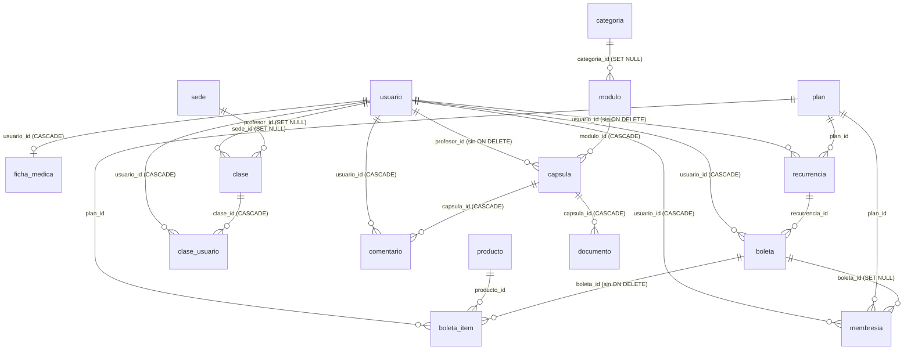

# Documentación de la Base de Datos — FutPlay (v2, estructura real)

> Construida con las definiciones reales de funciones, triggers, FKs, permisos y policies de la base de producción (Supabase `cdhbfyqtubqnmgjdgkab`, PostgreSQL 17).
> **Actualizada: 2026-10-10**, después de la auditoría de seguridad (ver §8). Reemplaza a `DOCUMENTACION_BD.md` (v1).
> Datos a esa fecha: 94 usuarios, 65 membresías, 122 reservas, 99 boletas, 43 clases, 13 planes.

## 1. Qué es el sistema

Plataforma de un club deportivo en Chile (Next.js + Supabase) con:
- **Planes y membresías por tokens** (mensuales y trimestrales). Cada reserva de un entrenamiento o clase kids consume 1 token; los partidos no.
- **Reservas** de clases y partidos, con cupo y control de asistencia.
- **Pagos con Flow** (boletas) y planes regalados por el administrador (membresía sin boleta). Los cobros recurrentes **no están soportados** (ver §8).
- **Contenido on-demand**: categorías → módulos → cápsulas (video en Bunny, con URL firmada) + documentos + comentarios.
- **Ficha médica** del socio (visible solo para el propio socio y los administradores).
- **Bot de WhatsApp** (servicio aparte en `webhook/`) que confirma o cancela asistencia y manda recordatorios.

Roles (`rol_usuario`): `administrador`, `profesor`, `jugador`.
Tipos de evento (`clase.tipo_evento`): `entrenamiento`, `kids`, `partido`.
Tipos de plan (`plan.tipo_plan`): `normal`, `familiar`, `kids`, `liga`.

## 2. Esquemas

| Schema | Uso |
|---|---|
| `public` | Negocio (17 tablas, incluida `tokens_no_devueltos`) |
| `mock` | Copia de pruebas desfasada. Cerrada a la API. Eliminar tras ~30 días de estabilidad |
| `backup_20261005` | Respaldo del 2026-10-05 (datos personales). Sin acceso desde la API. Eliminar tras ~30 días |
| `supabase_migrations` | Registro de migraciones aplicadas con la herramienta de Supabase (desde 2026-10-10) |
| `auth`, `storage`, `realtime`, `vault`, `extensions`, `cron`, `graphql*` | Supabase y extensiones |

## 3. Modelo y llaves foráneas reales

`usuario.id` → `auth.users(id)` `ON DELETE CASCADE`.

- **Borrado de alumnos:** `boleta_item.boleta_id` no tiene `ON DELETE`. Por eso `DELETE /api/admin/students` **rechaza con 409 a un alumno con boletas** (se conserva el historial financiero). Sin boletas, borra `recurrencia` y luego el usuario de `auth.users`, que cascadea al resto.
- `link-usuario` hace `UPDATE usuario SET id`. Las FK a `usuario(id)` son `NO ACTION`, así que solo funciona si el usuario aún no tiene filas dependientes. La ruta exige el token de sesión (ver §8).

## 4. Diccionario por tabla (reglas de negocio)

### usuario
`id`, `nombre`, `email`, `telefono` (único), `rol` (enum), `rut`, `foto_url`, `created_at`, `updated_at`.
- RUT: único normalizado (sin puntos ni guion, en mayúsculas); ignora NULL y vacío. El check de formato es `^[0-9]{7,8}[0-9K]$`; **no** valida el dígito verificador.
- `rol` solo lo cambia un administrador (trigger `proteger_rol_usuario`) o el servidor con la clave de servicio.
- El **email también vive en `auth.users`**: las rutas admin que lo editan lo actualizan en ambos lados (`src/lib/auth-email.ts`).

### plan
`id`, `nombre`, `precio` (nullable), `tokens_mensuales`, `dias`, `dias_vigencia`, `tipo_plan`, `codigo_acceso`, `activo`, `created_at`, `updated_at` (además de `codigo_acceso_hash`, que es residual).
- **`dias` es la fuente de verdad** (lo que escribe el admin). `dias_vigencia` (NOT NULL, default 30) se sincroniza con el trigger `trg_plan_sincronizar_dias`.
- Trimestrales: `dias = dias_vigencia = 90` (Básico, Pro, Proyección).
- La vigencia de la membresía es `plan.dias` días desde el inicio.
- **`codigo_acceso` es secreto**: es el link de los planes `familiar` y `liga`. Los roles `anon` y `authenticated` **no tienen SELECT** sobre `codigo_acceso` ni `codigo_acceso_hash` (permiso por columna). El cliente debe pedir columnas explícitas (`PLAN_COLUMNAS_PUBLICAS` en `src/lib/plan-columnas.ts`): `select("*")` sobre `plan` falla para usuarios.

### membresia
`id`, `usuario_id`, `plan_id`, `boleta_id` (NULL = plan regalado), `tokens_totales`, `tokens_usados`, `fecha_inicio`, `fecha_vencimiento`, `estado` (**boolean**), `congelada`, `fecha_congelamiento`, `sin_tokens`, `created_at`, `updated_at`.
- **Vigente:** `estado = true`, `congelada = false` y `fecha_inicio <= now() <= fecha_vencimiento`.
- **Tokens agotados:** `estado = false` y `sin_tokens = true` (los partidos siguen permitidos).
- **Vencida** (`fecha_vencimiento < now()`, no congelada): `estado = false` y **`tokens_usados := tokens_totales`** (se pierde el saldo no usado).
- **Fechas:** son timestamptz con el **instante real** (`new Date()`). Hasta el 2026-10-09 se guardaban 3 h antes en verano o 4 h antes en invierno por `ahoraChile()`. Esa función se eliminó y las 57 filas afectadas se corrigieron (ver §8).
- Único `(usuario_id, fecha_inicio)` (`uq_membresia_user_mes`).
- **Regla para comprar un plan nuevo:** solo bloquea una membresía vigente **con tokens** (`usuario_tiene_membresia_vigente`). Una agotada no bloquea.
- **Edición manual de tokens** (`/api/admin/membresias/gestion`): si `tokens_usados >= tokens_totales` se fuerza `sin_tokens = true` y `estado = false`; si se le devuelven tokens a una agotada, se reactiva.
- La membresía creada por un pago de **Plan Liga** es un registro inactivo (`estado = false`, 0 tokens) que no afecta a la vigente.

### boleta / boleta_item
Boleta: `usuario_id`, `estado` (`pendiente`, `pagado`, `anulado`, `rechazado`), `total`, `transaccion_id` (único si no es nulo), `recurrencia_id`, `flow_confirmada`, `cuotas`, `created_at`, `updated_at`.
- **Flow es la fuente de verdad:** si `getStatus` confirma el pago, el webhook y `flow/confirm` marcan la boleta como `pagado` **aunque estuviera `anulado` o `rechazado`**. El frontend anula boletas "huérfanas" cuando el alumno vuelve sin pasar por Flow.
- La membresía de una boleta pagada se asegura en **cada** notificación (es idempotente gracias al índice único `boleta_id`). Si falla al crearla, el webhook responde 500 para que Flow reintente.
- Ítem: `plan_id` o `producto_id`, `cantidad`, `precio`, `total`.

### recurrencia
`usuario_id`, `plan_id`, `activa`, `proveedor_ref`, `proxima_cobranza`, `cancelada_at`, `fallos_consecutivos`, `created_at`, `updated_at`.
- **Sin uso:** `create-order` ignora `recurrencia` y el webhook ya no genera cobros recurrentes (ver §8). La tabla está vacía.

### clase / clase_usuario
Clase: `titulo` (enum `tipo_clase`), `descripcion`, `sede_id`, `profesor_id`, `cupo_maximo` (nullable; NULL = 15), `fecha_hora` (timestamptz, en UTC), `tipo_evento`.

Reserva (`clase_usuario`): `id`, `usuario_id`, `clase_id`, `asistencia`, `created_at`, `updated_at`. **No hay `membresia_id`.**
- `asistencia` (enum) es la única columna de estado:
  - `sin_confirmar`: recién inscrito.
  - `pendiente`: el bot ya mandó el recordatorio.
  - `confirmado_whatsapp`: el alumno confirmó.
  - `asistio` / `no_asistio`: marcados por el profesor o por el scheduler.
  - `cancelado` / `cancelado_sin_reembolso`.
- Cupo: `coalesce(cupo_maximo, 15)` contra las reservas no canceladas. Hay un índice único parcial que impide una reserva activa duplicada.
- **Cancelación** (app y bot): con ≥ 3 h de anticipación queda `cancelado` y se devuelve el token; entre 1 y 3 h, `cancelado_sin_reembolso`; con < 1 h no se permite (en la app). Los partidos nunca devuelven token. La fecha se toma de `clase.fecha_hora`, **nunca del cliente**.
- **Compatibilidad plan ↔ clase:** un plan `kids` solo permite reservar clases `kids`; un plan `normal` no puede reservar `kids`. `familiar` y `liga` pueden reservar cualquier tipo. Lo valida el trigger, así que rige también para inserciones directas por REST.

### tokens_no_devueltos
Auditoría de los tokens que no se pudieron devolver al borrar una clase (`clase_id`, `usuario_id`, `asistencia`, `motivo`). RLS activo **sin policies**: solo se lee con la clave de servicio.

### Contenido
`categoria` → `modulo` → `capsula` (`bunny_video_id`, `profesor_id`, `order_index`) → `documento`, `comentario`.
- **Acceso a contenido pago** (`src/lib/acceso-contenido.ts`): lo tienen el staff y los alumnos con una membresía **vigente por fechas**, no congelada, con `tokens_totales > 0` y `estado = true` o `sin_tokens = true`.
- El video se sirve con una **URL firmada de Bunny**: `token = SHA256(BUNNY_TOKEN_KEY + videoId + expires)`. La genera el servidor y solo para quien tiene acceso.
- `/api/download-documento` exige sesión y acceso.

### ficha_medica
`usuario_id` (PK), `peso_kg`, `estatura_cm`, `imc` (columna normal que envía la app), `fecha_nacimiento`, `enfermedades`, `alergias`, `medicamentos`, `observaciones`, `historial_lesiones`, `afecciones_cardiacas`, `perfil`, `updated_at`. **Dato sensible.**

## 5. Funciones y triggers

| Función | Trigger / uso | Qué hace |
|---|---|---|
| `manejar_inscripcion_clase()` | `BEFORE INSERT` en `clase_usuario` | Valida que haya membresía vigente y la **compatibilidad plan ↔ tipo de clase** (kids/normal). Consume 1 token (no en partidos) y cierra la membresía al agotarla. Bloquea la fila de la membresía (`FOR UPDATE`). Mensajes: `Clase no encontrada`, `No tienes membresía activa`, `Tu plan Kids solo permite reservar clases Kids`, `Esa clase es exclusiva para el plan Kids`, `No tienes tokens disponibles`. |
| `limitar_15_alumnos()` | `BEFORE INSERT` en `clase_usuario` | Cuenta las reservas no canceladas contra `coalesce(cupo_maximo, 15)` y bloquea la clase (`FOR NO KEY UPDATE`). Mensaje: `Clase llena (n) / cupo n`. |
| `devolver_tokens_al_borrar_clase()` | `BEFORE DELETE` en `clase` | Devuelve el token **solo** a las reservas activas (`sin_confirmar`, `pendiente`, `confirmado_whatsapp` o NULL), **solo** si la clase no ha ocurrido y **no** en partidos. Lo que no se pudo devolver queda en `tokens_no_devueltos`. |
| `limpiar_inscripciones_al_vencer()` | `BEFORE DELETE` y `AFTER UPDATE OF estado` en `membresia` (cuando pasa a false y `sin_tokens` no es true) | Borra las reservas **futuras** pendientes si no queda otra membresía vigente. |
| `sincronizar_estado_membresia()` | `BEFORE INSERT/UPDATE OF fecha_vencimiento, estado, congelada` | Al vencer: `estado = false` y `tokens_usados = tokens_totales`. |
| `bloquear_regalo_con_membresia_vigente()` | `BEFORE INSERT` en `membresia` | Impide crear una membresía sin boleta (regalo) si ya hay una vigente. |
| `mantener_dias_plan_sincronizados()` | `BEFORE INSERT/UPDATE` en `plan` | Mantiene `dias` y `dias_vigencia` iguales (`dias` manda). |
| `devolver_token(uuid)` | RPC (solo `service_role`) | Resta 1 a `tokens_usados` de la membresía vigente o cerrada por tokens. No toca `estado`. |
| `usuario_tiene_membresia_vigente(uuid)` | RPC (`authenticated`) y `create-order` | `true` si hay una membresía activa, vigente y con tokens. Un usuario solo puede consultar **la suya** (o el staff, o el servidor con `auth.uid()` nulo). |
| `check_is_staff()` | Policies | `true` si el usuario autenticado es administrador o profesor. |
| `proteger_rol_usuario()` | `BEFORE UPDATE` en `usuario` | Solo un administrador puede cambiar roles. |
| `handle_new_user()` | `AFTER INSERT` en `auth.users` | Crea la fila de `usuario` con rol `jugador`. |

**Permisos:** las funciones de trigger **no** son invocables por RPC (se revocó `EXECUTE` a `anon` y `authenticated`). Se eliminaron las funciones sin uso `check_membresia_activa`, `get_proxima_clase` e `inscribir_usuario_clase`.

**Tareas programadas** (`cron`, en UTC):
- `futplay-expirar-membresias` (`0 9 * * *`, 06:00 Chile en verano).
- `purge-cron-history` (`0 3 * * *`).

## 6. Seguridad (RLS)

RLS está activo en todas las tablas de `public`.

| Tabla | Lectura | Escritura |
|---|---|---|
| `usuario` | La propia o staff | Actualizar la propia (el rol lo protege el trigger) |
| `ficha_medica` | La propia o administradores | La propia |
| `boleta`, `boleta_item` | Las propias; el administrador gestiona todo | Solo administrador o servidor |
| `membresia` | Las propias o staff | Solo administrador (update) o servidor |
| `clase_usuario` | Las propias; profesor y administrador ven los inscritos | El jugador se inscribe (insert propio). **El profesor actualiza la asistencia solo de SUS clases** (`clase.profesor_id = auth.uid()`). |
| `recurrencia` | Las propias | Crear y editar las propias (sin uso) |
| `comentario` | Usuarios con sesión | Los propios |
| `documento` | Usuarios con sesión | Servidor |
| `plan` | Usuarios con sesión, **sin `codigo_acceso`** | Administrador |
| `producto`, `clase`, `sede`, `categoria`, `modulo` | Usuarios con sesión | Administrador |
| `capsula` | Usuarios con sesión (el video exige URL firmada) | Staff y administradores |
| `tokens_no_devueltos` | Solo servidor | Solo servidor |

Las rutas de servidor usan la clave de servicio (ignoran RLS): `flow/*`, `admin/*`, `clases/inscribir`, `clases/cancelar`, `download-documento` y `auth/link-usuario`. Todas validan la sesión o el rol antes de usarla, salvo `flow/webhook` y `flow/return`, que se validan contra Flow.

## 7. Migraciones

Desde el 2026-10-10 se registran en `supabase_migrations` (Database → Migrations en el panel). Los SQL quedan versionados en `docs/migrations/`.

| Archivo | Aplicada |
|---|---|
| `2026-10-auditoria-trigger-borrar-clase.sql` | `auditoria_trigger_borrar_clase` |
| `2026-10-auditoria-inscripcion-tipo-plan.sql` | `auditoria_inscripcion_tipo_plan` |
| `2026-10-auditoria-funciones.sql` | `auditoria_funciones_permisos` + los DROP corridos a mano en el SQL Editor |
| `2026-10-auditoria-plan-columnas.sql` | `auditoria_plan_columnas` |
| `2026-10-auditoria-rls-profesor.sql` | Corrida a mano en el SQL Editor |

Correcciones de datos del 2026-10-09 (sin archivo de migración):
- Se cerraron 2 membresías manuales con 0 tokens que seguían activas.
- Se sumaron +3 o +4 h a 57 membresías cuyas fechas estaban corridas por `ahoraChile()`. El rollback quedó guardado aparte.

## 8. Auditoría 2026-10 — resumen de cambios

| Problema | Arreglo |
|---|---|
| `/pagos` bloqueaba la compra a alumnos sin tokens | Se usa `usuario_tiene_membresia_vigente`, igual que `/planes` y `create-order` |
| La edición manual de tokens dejaba membresías con 0 tokens activas | Recalcular los flags en la ruta de gestión |
| Boleta anulada por el frontend pero pagada en Flow → sin membresía | Flow manda; el webhook y `confirm` reparan la membresía y reintentan si falla |
| Recurrencia: reenviar el webhook generaba membresías gratis | Recurrencia deshabilitada en `create-order` y en el webhook |
| Fechas de membresía 3–4 h antes de lo real | `ahoraChile()` eliminado + corrección de datos |
| `clases/cancelar` confiaba en la fecha que mandaba el cliente | Usa `clase.fecha_hora` |
| `codigo_acceso` legible por cualquier usuario | Permiso por columna revocado |
| Bot: endpoints HTTP públicos (suplantación) y reembolso de partidos | Endpoints y puerto eliminados; los partidos no reembolsan |
| `auth/link-usuario` sin autenticación | Exige Bearer token |
| El profesor podía modificar reservas de cualquier clase | RLS limitada a sus clases |
| Contenido pago visible sin membresía | URL firmada de Bunny y `download-documento` con acceso |
| Las cápsulas exigían una membresía iniciada en el mes calendario | Vigencia real + acceso para el staff |
| Borrar una clase devolvía tokens de más (94 hoy) | Trigger corregido |
| Borrar un alumno con pagos dejaba datos a medias | 409 si tiene boletas |
| Editar el email solo en `usuario` rompía el login | Sincronización con `auth.users` |
| "Activo" no reactivaba la membresía | Se reactivan también `estado` y `sin_tokens` |
| Validación kids/normal evitable por REST | Movida al trigger |

## 9. Riesgos conocidos (pendientes)

1. `devolver_token` elige la membresía por vigencia, no la que se usó en la reserva.
2. El saldo de tokens se pierde al vencer (`sincronizar_estado_membresia`).
3. Los profesores ven todos los perfiles y membresías (decisión aceptada).
4. **Bunny:** mientras no se active *Token Authentication* y se configure `BUNNY_TOKEN_KEY`, los videos se sirven sin firma.
5. **Supabase Auth:** *Leaked password protection* está desactivada (se activa desde el panel).
6. El bot de WhatsApp usa la clave pública si falta `SUPABASE_SERVICE_ROLE_KEY`, y sin ella `devolver_token` falla en silencio.
7. No hay tabla de auditoría ni historial de tokens.
8. Los esquemas `mock` y `backup_20261005` siguen en la base; hay que eliminarlos tras ~30 días de estabilidad.
