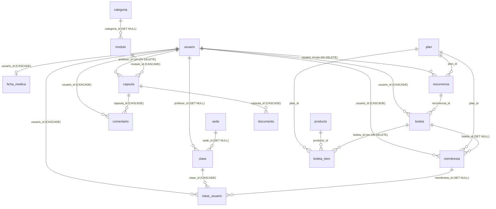

# Documentación de la Base de Datos — FutPlay (v2, estructura real)

> Reemplaza a `DOCUMENTACION_BD.md` (v1), que se escribió solo con nombres de columnas y contenía supuestos incorrectos (por ejemplo, que `membresia.estado` era texto). Esta versión se construyó con las definiciones reales de funciones, triggers, FKs y policies obtenidas de la base el 2026-10-05/06.
> Datos aproximados a esa fecha: ~50 membresías, ~94 reservas, ~73 boletas, 44 clases, 88 usuarios, 13 planes.

## 1. Qué es el sistema

Plataforma de un club deportivo en Chile (Next.js + Supabase) con:
- **Planes y membresías por tokens** (mensuales y trimestrales). Cada reserva a un entrenamiento o clase kids consume 1 token; los partidos no consumen.
- **Reservas** de clases y partidos con cupo y control de asistencia.
- **Pagos con Flow** (boletas, cobro recurrente) y planes regalados por el administrador (membresía sin boleta).
- **Contenido on-demand**: categorías → módulos → cápsulas (video en Bunny) + documentos + comentarios.
- **Ficha médica** del socio (visible solo para el propio socio y administradores).
- **Bot de WhatsApp** (servicio aparte en `webhook/`) que confirma/cancela asistencia y manda recordatorios.

Roles (`rol_usuario`): `administrador`, `profesor`, `jugador`.
Tipos de evento (`clase.tipo_evento`): `entrenamiento`, `kids`, `partido`.

## 2. Esquemas

| Schema | Uso |
|---|---|
| `public` | Negocio (16 tablas; `clase_backup_fechas` se movió a `backup_20261005`) |
| `mock` | Copia de pruebas desfasada. Cerrada a la API. Eliminar tras ~30 días de estabilidad |
| `backup_20261005` | Respaldo del 2026-10-05 (datos personales). Sin acceso desde la API. Eliminar tras ~30 días |
| `auth`, `storage`, `realtime`, `vault`, `extensions`, `cron` | Supabase / extensiones |

## 3. Modelo y llaves foráneas reales

`usuario.id` → `auth.users(id)` `ON DELETE CASCADE`.

> ⚠️ **Posible fallo de borrado de alumnos:** `boleta_item.boleta_id` y `recurrencia.usuario_id` no tienen `ON DELETE`. `admin/students` borra membresías, boletas, reservas y ficha, pero no ítems ni recurrencias. Verificar con una prueba en staging.
> `link-usuario` hace `UPDATE usuario SET id`: las FK a `usuario(id)` son `NO ACTION`, por lo que solo funciona si el usuario aún no tiene filas dependientes.

## 4. Diccionario por tabla (reglas de negocio)

### usuario
`id`, `nombre`, `email`, `telefono`, `rol` (enum), `rut`, `foto_url`, `created_at`.
- RUT: único normalizado (sin puntos ni guion, mayúsculas); ignora NULL y vacío. Check de formato `^[0-9]{7,8}[0-9K]$`; **no** valida dígito verificador.
- `rol` solo lo cambia un administrador (trigger `proteger_rol_usuario`) o el servidor con la clave de servicio.

### plan
`id`, `nombre`, `precio` (nullable), `tokens_mensuales`, `dias`, `dias_vigencia`, `tipo_plan` (`normal`, …), `codigo_acceso`, `created_at` (+ `activo`, `codigo_acceso_hash` residuales).
- **`dias` es la fuente de verdad** (lo que escribe el admin); `dias_vigencia` (NOT NULL, default 30) se sincroniza con el trigger `trg_plan_sincronizar_dias`.
- Trimestrales: `dias = dias_vigencia = 90` (Básico, Pro, Proyección).
- Vigencia de la membresía = `plan.dias` días desde el inicio.

### membresia
`id`, `usuario_id`, `plan_id`, `boleta_id` (NULL = plan regalado), `tokens_totales`, `tokens_usados`, `fecha_inicio`, `fecha_vencimiento`, `estado` (**boolean**), `congelada`, `fecha_congelamiento`, `sin_tokens`, `created_at`.
- `estado = true` y `congelada = false` y `fecha_inicio <= now() <= fecha_vencimiento` → membresía **vigente**.
- Al agotar tokens, `estado = false` y `sin_tokens = true` (partidos siguen permitidos).
- Al vencer (`fecha_vencimiento < now()`, no congelada): `estado = false` y **`tokens_usados := tokens_totales`** (se pierde el saldo no usado).
- Único `(usuario_id, fecha_inicio)` (`uq_membresia_user_mes`).
- `estado` y `sin_tokens` los escriben los triggers; no se envían en los INSERT.

### boleta / boleta_item
Boleta: `usuario_id`, `estado` (`pendiente`, `pagado`, `anulado`, `rechazado`), `total`, `transaccion_id` (único si no es nulo), `recurrencia_id`, `flow_confirmada`, `cuotas`, `created_at`, `updated_at`.
- `estado = 'pendiente'` es la guarda atómica de idempotencia del webhook y de `flow/confirm`.
- Ítem: `plan_id` o `producto_id`, `cantidad`, `precio`, `total`.

### recurrencia
`usuario_id`, `plan_id`, `activa`, `created_at`. Cancelar = `activa=false` (ruta `flow/cancel-recurrence`, con clave de servicio).

### clase / clase_usuario
Clase: `titulo`, `descripcion`, `sede_id`, `profesor_id`, `cupo_maximo` (nullable; NULL = 15), `fecha_hora`, `tipo_evento`.
- Las horas se guardan en UTC (una clase a las 20:00 de Chile se guarda como 23:00+00).
- Reserva: **`asistencia` es la única columna de estado.** Valores en BD: `sin_confirmar`, `asistio`, `no_asistio`, `cancelado`, `cancelado_sin_reembolso`. El código también tolera `pendiente`, `presente`, `ausente`.
- Cupo: `coalesce(cupo_maximo, 15)` contra reservas no canceladas.
- Cancelación (app): ≥ 3 h antes → `cancelado` + token devuelto; entre 1 y 3 h → `cancelado_sin_reembolso`; < 1 h → no se permite.
- `membresia_id` en `clase_usuario` existe (FK `SET NULL`).

### Contenido
`categoria` → `modulo` → `capsula` (`bunny_video_id`, `profesor_id`, `order_index`) → `documento`, `comentario`.

### ficha_medica
`usuario_id`, `peso_kg`, `estatura_cm`, `imc` (columna normal que la app envía), `fecha_nacimiento`, `enfermedades`, `alergias`, `medicamentos`, `observaciones`, `historial_lesiones`, `afecciones_cardiacas`, `perfil`, `updated_at`. **Dato sensible.**

## 5. Funciones y triggers

| Función | Trigger / uso | Qué hace |
|---|---|---|
| `manejar_inscripcion_clase()` | `BEFORE INSERT` en `clase_usuario` | Valida membresía vigente; consume 1 token (no en partidos); cierra la membresía al agotarla. Bloquea la fila de membresía (`FOR UPDATE`) en la rama no-partido. Mensajes: `Clase no encontrada`, `No tienes membresía activa`, `No tienes tokens disponibles`. |
| `limitar_15_alumnos()` | `BEFORE INSERT` en `clase_usuario` | Cuenta reservas no canceladas contra `coalesce(cupo_maximo,15)`; bloquea la clase (`FOR NO KEY UPDATE`). Mensaje `Clase llena (n) / cupo n`. |
| `limpiar_inscripciones_al_vencer()` | `BEFORE DELETE` y `AFTER UPDATE OF estado` (cuando pasa a false y `sin_tokens` no es true) en `membresia` | Borra reservas **futuras** pendientes si no queda otra membresía vigente. |
| `sincronizar_estado_membresia()` | `BEFORE INSERT/UPDATE OF fecha_vencimiento, estado, congelada` | Al vencer: `estado=false`, `tokens_usados=tokens_totales`. |
| `mantener_dias_plan_sincronizados()` | `BEFORE INSERT/UPDATE OF dias, dias_vigencia` en `plan` | Mantiene ambas columnas iguales (`dias` manda). |
| `devolver_token(uuid)` | RPC (solo `service_role`) | Resta 1 a `tokens_usados` de la membresía vigente o cerrada por tokens; no toca `estado`. |
| `check_is_staff()` | Policies | `true` si el usuario autenticado es administrador o profesor. |
| `proteger_rol_usuario()` | `BEFORE UPDATE OF rol` en `usuario` | Solo un administrador puede cambiar roles. |
| `handle_new_user()` | Alta en `auth.users` | Crea la fila de `usuario` con rol `jugador`. Verificar que el trigger siga activo. |

Tareas programadas (`cron`): `futplay-expirar-membresias` (diaria, 06:00 Chile) y `purge-cron-history` (diaria, 00:00 Chile).

## 6. Seguridad (RLS)

RLS activo en todas las tablas de `public`. Resumen de policies:

| Tabla | Lectura | Escritura |
|---|---|---|
| `usuario` | Propio o staff | Actualizar el propio (el rol lo protege el trigger) |
| `ficha_medica` | Propia o administradores | Propia (insert/update) |
| `boleta`, `boleta_item` | Propias; administrador gestiona todo | Solo administrador / servidor |
| `membresia` | Propias o staff | Solo administrador (update) / servidor |
| `clase_usuario` | Propias; profesor/administrador ven inscritos | Jugador se inscribe (insert propio); profesor actualiza asistencia |
| `recurrencia` | Propias | Crear/editar propias |
| `comentario` | Usuarios con sesión | Propios |
| `documento` | Usuarios con sesión | Servidor |
| `plan`, `producto`, `clase`, `sede`, `categoria`, `modulo` | Usuarios con sesión | Administrador |
| `capsula` | (ver policies de la tabla) | Staff / administradores |

Las rutas de servidor usan la clave de servicio (ignoran RLS): `flow/*`, `admin/*`, `clases/cancelar`, `download-documento`.

## 7. Riesgos conocidos (no resueltos con SQL)

1. `devolver_token` elige la membresía por vigencia, no la que se usó en la reserva.
2. El saldo de tokens se pierde al vencer (`sincronizar_estado_membresia`).
3. Webhook de Flow: el `insert` de `boleta_item` no se verifica antes de marcar `pagado`.
4. Profesores ven todos los perfiles y membresías (decisión aceptada).
5. Tres reglas distintas de "tengo membresía" entre la app (`MiAsistencia`, página de cápsulas, `userHasMembresia`) y la BD.
6. `ahoraChile()` desfasa 3 horas las membresías creadas por Flow.
7. `capsula` y `documento` no verifican membresía para ver contenido (cualquier usuario con sesión lo lee).
8. El bot de WhatsApp cae a la clave pública si falta `SUPABASE_SERVICE_ROLE_KEY`; con ella ausente `devolver_token` falla en silencio.
9. Sin tabla de auditoría ni de historial de tokens.
